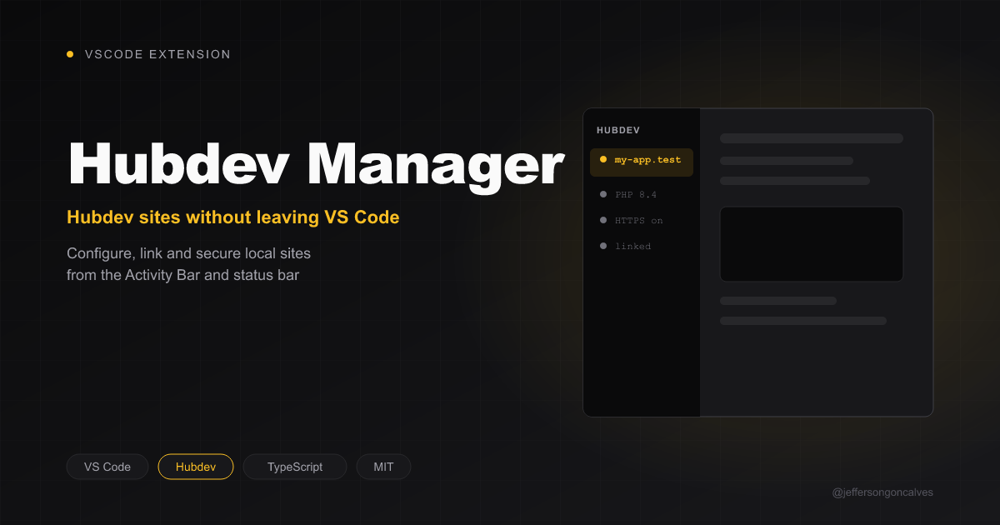

# HubDev Manager for VS Code

[](https://buymeacoffee.com/jeffersongoncalves)

> Manage your HubDev local development sites directly from VS Code.

**JSG HubDev Manager** integrates [HubDev](https://hubdev.io) into VS Code: see whether the open project is registered in HubDev's central `sites.yml`, link/unlink it, start/stop it, renew SSL and open it in the browser. It is the VS Code port of the [HubDev Manager](https://github.com/jeffersongoncalves/hubdev-manager-plugin) JetBrains plugin.

## Features

- **Auto-detection** — finds HubDev on Windows (`devhub.exe` under Program Files, or `hubdev`/`devhub` on PATH), macOS and Linux
- **Site status** — reads `~/.devhub/config/sites.yml` and shows the project's domain, PHP version, database, mode and active state
- **Link / Unlink** — `hubdev site:link <path> <name>` / `site:unlink <name>`
- **Start / Stop** — `site:start` / `site:stop`
- **Renew SSL** — `site:secure`
- **Open in Browser** — `https://<domain>`
- **Open HubDev App** — launches the desktop app
- **Status bar item** and **startup hint** when the project isn't linked
- **Reactive** — the view refreshes when `sites.yml` changes on disk

A project is linked when its folder matches a site's `path` (slashes, case and trailing separators are ignored).

## Requirements

- VS Code 1.85+
- [HubDev](https://hubdev.io) installed
- A PHP project folder (the extension activates when the workspace has `artisan` or `composer.json`)

## Usage

Open the **HubDev** view in the Activity Bar. The toolbar shows **Link Site** (or **Start**/**Stop**), **Open in Browser** and **Refresh**; **Renew SSL**, **Unlink Site** and **Open HubDev App** are in the `…` menu. Click the domain to open the site.

| Command | ID |
|---|---|
| HubDev: Link Site | `hubdev.link` |
| HubDev: Unlink Site | `hubdev.unlink` |
| HubDev: Start Site | `hubdev.start` |
| HubDev: Stop Site | `hubdev.stop` |
| HubDev: Renew SSL Certificates | `hubdev.secure` |
| HubDev: Open in Browser | `hubdev.openInBrowser` |
| HubDev: Open HubDev App | `hubdev.openApp` |
| HubDev: Refresh | `hubdev.refresh` |

## Development

```bash
pnpm install
pnpm run watch   # F5 launches an Extension Development Host
pnpm test        # unit tests (node:test, no VS Code instance needed)
pnpm run lint
pnpm dlx @vscode/vsce package --no-dependencies   # build a .vsix
```

## License

[MIT](LICENSE)

## Author

**Jefferson Goncalves** — [GitHub](https://github.com/jeffersongoncalves)
